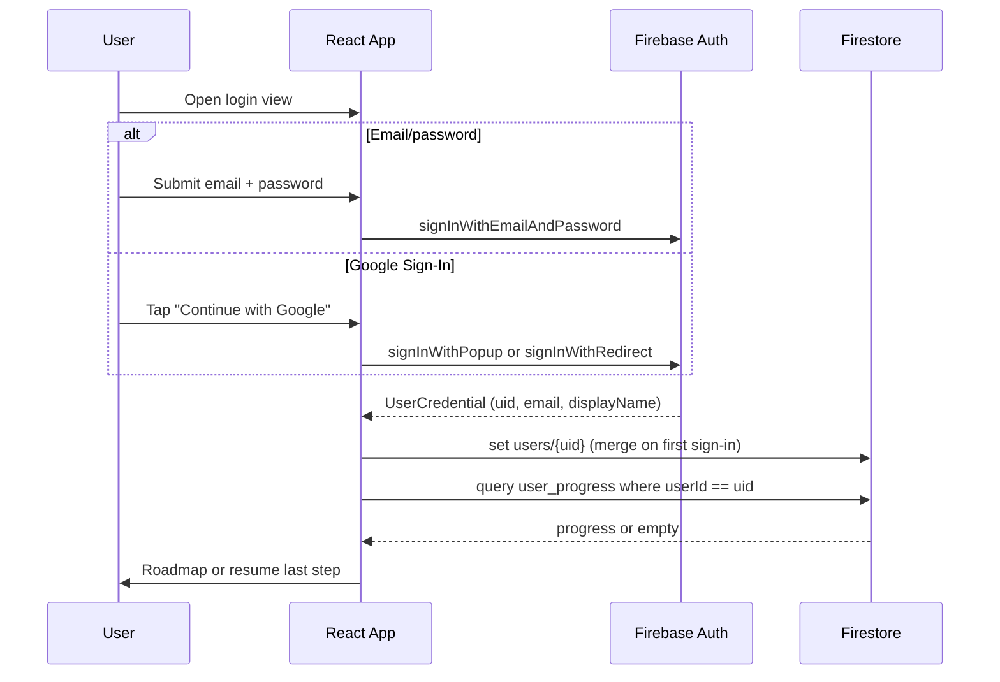

# Product Requirements Document (PRD): ActiveLearn MVP

**Version:** 0.4  
**Date:** June 22, 2026  
**Status:** Draft  
**Stack:** React · Firebase (Auth, Firestore, Hosting) · SVG · plain CSS

---

## 1. Executive Summary & MVP Definition

The goal of this MVP is to build a **high-performance, mobile-responsive web application** modeled on Brilliant's "learn-by-doing" pedagogical framework. Moving completely away from static video lectures or generic multiple-choice quizzes, the platform focuses on **interactive visual problem-solving**.

Following a strict project cadence, this MVP **explicitly bans all AI features, model calls, or LLM-generated hints**. It serves as a pure structural test of a single, hand-crafted interactive lesson path that can teach a complex concept natively through visual mechanics and **hardcoded, specific feedback loops**.

### What the MVP Is

A signed-in learner can:

1. Authenticate via Firebase (**email/password** or **Google Sign-In**) and land on a **linear course roadmap** (4–7 algebra lessons).
2. Work through each lesson as a **multi-step sequence** of concept setups and interactive visual slides.
3. Interact with a custom **Scale-Balancing widget** — dragging terms across an equals sign, tapping to apply operations to both sides, or sliding values to balance an equation.
4. Receive **instant, sub-100ms feedback** with dedicated text explanations keyed to specific mistake types.
5. **Resume mid-lesson** on any device; progress and streak persist in Firestore.

### MVP Success Criteria

| Criterion | Target |
|-----------|--------|
| End-to-end flow | Sign in → lesson 1 → lesson 4+ → roadmap shows unlock progression |
| Interactive fidelity | Scale-balancing widget teaches equation isolation through visual manipulation — no generic MCQ buttons |
| Feedback latency | Client-side validation + explanation render **< 100ms** after submit |
| Performance | 60 FPS drag/slider animations; initial route load **< 2s** on mobile 4G |
| Reliability | Progress survives tab close, browser restart, and cross-device login |
| Content scope | **Algebra only** — 4–7 linear lessons on visual equation balancing |
| AI ban | Zero Anthropic/OpenAI integrations; zero automated hint generation |

### Alignment with Submission Rubric (Phase 1)

| Rubric requirement | PRD mapping |
|--------------------|-------------|
| One subject, deep not wide | Algebra — visual equation balancing only |
| One interactive lesson minimum | Lesson 1 hand-crafted first; expand to 4–7 |
| Manipulation (drag/tap/slider) | Scale-Balancing widget |
| Visual element that responds | SVG balance scale tilts in real time |
| Instant specific feedback | Hand-written `explanations` map, < 100ms |
| Progress persists mid-lesson | `user_progress.currentStepId` |
| Auth + mobile + deployed | Firebase Auth; mobile-first CSS; Firebase Hosting |
| No AI in MVP | Hard gate — Phase 2 only |

---

## 2. Target Domain & User Persona

### 2.1 Chosen Domain: Algebra (Visual Equation Balancing)

To anchor the structural and data footprint of the MVP, the platform is **exclusively built around Algebra**. The primary lesson arc teaches how to **isolate variables and solve equations** by physically balancing a scale or manipulating terms.

All lesson content, widget configs, validation rules, and explanations are **hand-written JSON** — not dynamically generated.

### 2.2 Core Domain Concepts

```
Subject: algebra
  └── Lesson     Linear unit (e.g., "Intro to Equation Scales")
        └── Step   Atomic slide: instruction + widgetConfig + validationRules + explanations
              └── WidgetState   Serializable balance-scale state (left/right terms, operations applied)

User           Firebase Auth profile
UserProgress   Composite key userId_lessonId → currentStepId, completedSteps, streak
```

### 2.3 Ubiquitous Language

| Term | Definition |
|------|------------|
| **Step** | Single slide in a lesson; atomic unit of progress |
| **Scale-Balancing widget** | Interactive SVG/DOM component showing equation terms on a physical balance scale |
| **widgetConfig** | JSON props passed into the widget (weights, equations, target variable) |
| **validationRules** | Expected left/right equation state after user manipulation |
| **explanations** | Hand-written feedback map keyed by outcome (`correct`, `wrong_moved_incorrectly`, etc.) |
| **Streak** | Consecutive calendar days with ≥1 completed step (`streakCount`) |

### 2.4 Target User Persona

**Name:** Alex  
**Profile:** A middle school student learning algebra who gets easily disengaged by long video lectures or dense algebraic notation textbooks.

**Needs:**
- Visual intuition over symbolic abstraction
- Immediate confirmation of logic steps
- Frictionless mobile execution during short daily breaks

**MVP design implication:** Mobile-first viewport, touch-native interactions, short session length (~5–10 min per lesson).

### 2.5 Out of MVP Focus

| Persona | Why deferred |
|---------|--------------|
| Adult self-learner / engineer | Content and UX tuned for middle school algebra |
| Parent / educator | No classroom, assignments, or reporting |
| Premium subscriber | No paywall or trial conversion |

---

## 3. Scope Definition

### 3.1 In-Scope for MVP (Hard Gates)

| Area | Requirement |
|------|-------------|
| **Auth** | Firebase Authentication — **email/password** and **Google Sign-In** |
| **Lessons** | **4–7 interactive lessons** — linear, multi-step sequence with concept setups and visual slides |
| **Scale-Balancing widget** | Custom component: drag terms across `=`, tap operations on both sides, slide values to balance — **no generic multiple-choice buttons** |
| **Feedback engine** | Instant client-side validation; dedicated text explanations per mistake type; **< 100ms** to display |
| **Progress tracking** | Firebase Auth + Firestore: completed lesson slices, `currentStepId`, streak |
| **Performance** | 60 FPS slider/drag animations; **< 2s** initial route load; strict **mobile-first** viewport |
| **Content model** | Structured JSON tree (not raw HTML blobs); all explanations hand-authored |
| **Course routing (P1)** | Linear roadmap; lock/unlock milestones based on `isCompleted` |
| **Gamification (P1)** | Daily streak counter + visual celebration on step/lesson mastery |
| **Deployment** | Public deploy on Firebase Hosting |

### 3.2 Out-of-Scope for MVP

| Feature | Phase | Rationale |
|---------|-------|-----------|
| **AI elements / chatbot tutors** | Phase 2 | Zero Anthropic/OpenAI; no Koji-style features |
| **AI lesson generation** | Phase 2 | All content is hand-written JSON |
| **Automated hint generation** | Phase 2 | Hints are pre-authored in `explanations` maps |
| **Account linking** | Phase 2 | Email + Google cannot be merged to one profile in MVP; `linkWithCredential` deferred |
| **Interleaving** | Phase 3 | Learning science enhancement |
| **Spaced repetition engines** | Phase 3 | Deferred |
| **Knowledge tracing** | Phase 3 | Deferred |
| **Competitive leagues** | Phase 3 | Social gamification |
| **Premium paywalls** | Phase 3 | Monetization |
| **Multi-course selection hubs** | Phase 3 | Algebra-only for MVP |
| **Onboarding competency quiz** | — | Not in MVP; auth gate only |
| **Native mobile apps** | — | Responsive web only |
| **CMS / content admin UI** | Phase 2+ | Seed Firestore or repo JSON manually |
| **Third-party UI / animation libraries** | — | No Tailwind, Framer Motion, MUI, etc. — styling and motion via plain CSS + SVG only |
| **Backend beyond Firebase** | — | No custom servers, Cloud Functions, or non-Firebase APIs in MVP |

---

## 4. User Stories

### 4.1 Targeted (Core Focus)

| ID | Story | Acceptance Hint |
|----|-------|-----------------|
| U1 | As a learner (**Alex**), I want to **drag a variable across an interactive balancing scale** so that I can visually watch the weight shift and gain instant intuition on algebraic balance. | Scale tilts in real time; no MCQ fallback |
| U2 | As a learner, I want to **receive an explanation the moment I submit an incorrect algebraic distribution step** so I can correct my logic path immediately. | Matching key from `explanations` map; visible in < 100ms |
| U3 | As a learner, I want to **close the app midway through an equation set on my desktop and resume on my phone** at the exact slide I left off, preserving my historical login streak. | `user_progress.currentStepId` restored on auth hydrate |
| U4 | As a learner, I want to **see a roadmap of lockable lesson nodes** so I know what to do next. | Lesson 2 locked until Lesson 1 `isCompleted: true` |
| U5 | As a learner, I want to **sign in with email/password or Google** so my progress is saved securely with minimal friction. | Firebase Auth (both providers); protected routes; `users/{uid}` created on first sign-in |
| U6 | As a learner (**Alex**), I want to **use Google Sign-In on my phone** so I can start a lesson without creating a new password. | Google provider via `signInWithPopup` (desktop) or `signInWithRedirect` (mobile); same `uid`-keyed progress as email |
| U7 | As a learner, I want to **see my daily streak** so I stay motivated to return. | `streakCount` badge in nav; increments once per calendar day |

### 4.2 Deferred (Not Focused for MVP)

| ID | Story | Phase |
|----|-------|-------|
| X1 | As a learner, I want to **ask an AI chatbot for custom algebra tips** when I get stuck. | Phase 2 |
| X2 | As a learner, I want the app to **automatically serve an interleaved review quiz** based on my past weak topic performance. | Phase 3 |
| X3 | As a learner, I want to **compete in weekly XP leagues** with other students. | Phase 3 |
| X4 | As a user, I want to **subscribe to unlock premium algebra courses**. | Phase 3 |
| X5 | As a content author, I want a **visual CMS** to author lessons without editing JSON. | Phase 2+ |

---

## 5. Technical Stack & Architecture

### 5.1 Allowed Stack (Hard Constraint)

Runtime dependencies are limited to **React**, the **Firebase JS SDK**, and **SVG** (plus standard web APIs). Everything else is implemented with plain CSS, React state/hooks, and browser pointer/touch events.

| Allowed | Examples |
|---------|----------|
| **React** | Components, Context, hooks (`useState`, `useEffect`, `useRef`, `useCallback`), conditional view routing |
| **Firebase** | Authentication (email/password + Google provider), Cloud Firestore, Firebase Hosting |
| **SVG** | Inline `<svg>` elements, `<g>` transforms, native SVG drag via React-coordinated `transform` attributes |
| **Plain CSS** | CSS modules or global stylesheets; `@media` queries; CSS `transition` / `transform` for 60 FPS motion |
| **Web APIs** | Pointer Events, Touch Events, `requestAnimationFrame`, Performance API |
| **TypeScript** | Type safety (compiles away; no runtime cost) |

| **Not allowed (runtime)** | Why |
|---------------------------|-----|
| Tailwind CSS, Bootstrap, MUI, Chakra, etc. | Third-party UI frameworks |
| Framer Motion, GSAP, react-spring, etc. | Third-party animation libraries |
| react-router-dom (unless explicitly approved later) | Extra routing package — use React conditional views instead |
| Zustand, Redux, Jotai, etc. | Third-party state libraries — use React Context |
| Cloud Functions, Express, Supabase, etc. | Non-Firebase backend |
| Canvas/WebGL libraries (Pixi, Three.js) | Out of scope; SVG is sufficient for MVP |

**Dev tooling** (build/lint only, not shipped to users): Vite, ESLint, TypeScript compiler.

**Content seeding:** One-time Firestore seed scripts may use the Firebase Admin SDK in Node — this is a deploy/setup tool, not part of the user-facing app.

**Demo mode:** When Firebase env vars are absent, app may use `localStorage` for local development only. Production submission requires Firebase Auth + Firestore.

### 5.2 Stack Overview

```
┌──────────────────────────────────────────────────────────────────┐
│                         React SPA                                │
│  ┌──────────────┐  ┌─────────────────┐  ┌────────────────────┐ │
│  │ LessonContext│  │ EquationScale   │  │ Roadmap / Auth UI  │ │
│  │ + step nav   │  │ (inline SVG)    │  │ + streak badge     │ │
│  └──────┬───────┘  └────────┬────────┘  └─────────┬──────────┘ │
│         │                   │                      │             │
│         │     plain CSS + SVG transforms           │             │
│         │     Pointer Events / requestAnimationFrame │             │
└─────────┼───────────────────┼──────────────────────┼─────────────┘
          │                   │                      │
          ▼                   ▼                      ▼
   lessons (Firestore)   client evaluators    Firebase Auth
                              │               user_progress
                              ▼
                       async write on
                       step completion
```

| Layer | Technology | Role |
|-------|------------|------|
| UI framework | React 19 | Components, lesson engine, view routing |
| Styling | Plain CSS (modules or global) | Mobile-first responsive layout |
| Graphics & motion | Inline SVG + CSS `transform` / `transition` | Balance scale, drag feedback, 60 FPS targets |
| Interaction | React hooks + Pointer/Touch Events | Drag terms, tap operations |
| State | React Context (`LessonContext`) | Active step index, session widget state |
| Auth | Firebase Authentication | Email/password + Google Sign-In |
| Database | Cloud Firestore | `users`, `lessons`, `user_progress` |
| Hosting | Firebase Hosting | Production deploy |

> **No Cloud Functions in MVP.** All validation is client-side; Firestore writes are async on step completion.

### 5.3 Lesson Engine Design

Each step in a lesson document declares a `type`, `widgetConfig`, `validationRules`, and `explanations`. The engine:

1. Hydrates `user_progress` for the active user + lesson.
2. Resolves `currentStepId` to an index in the lesson's `steps` array.
3. Passes `widgetConfig` into `EquationScale` (or `visual-intro` variant).
4. On submit, runs the client-side checker against `validationRules`.
5. Looks up feedback from `explanations` by outcome key (< 100ms).
6. On correct: async Firestore write; advance step; update streak if applicable.

**Step schema (TypeScript):**

```typescript
interface LessonStep {
  stepId: string;
  type: 'visual-intro' | 'scale-balance';
  instruction: string;
  widgetConfig: Record<string, unknown>;
  validationRules?: {
    expectedLeft: string;
    expectedRight: string;
  };
  explanations?: Record<string, string>;
}

interface Lesson {
  lessonId: string;
  title: string;
  subject: 'algebra';
  order: number;
  steps: LessonStep[];
}
```

### 5.4 Firebase Auth Configuration

MVP supports **two sign-in methods** via the Firebase JS SDK — no additional auth libraries.

| Method | Firebase API | UX notes |
|--------|--------------|----------|
| **Email/password** | `createUserWithEmailAndPassword`, `signInWithEmailAndPassword` | Email + password form on login/signup view |
| **Google Sign-In** | `signInWithPopup` or `signInWithRedirect` with `GoogleAuthProvider` | "Continue with Google" button; prefer **redirect** on mobile to avoid popup blockers |

**Firebase Console setup (required):**
1. Enable **Email/Password** provider.
2. Enable **Google** provider; configure OAuth consent screen and authorized domains (localhost + Firebase Hosting domain).
3. Add app domain to Google Cloud OAuth **authorized JavaScript origins**.

**First sign-in behavior (both providers):**
1. Firebase Auth returns `uid`, `email`, `displayName`, `photoURL`.
2. App upserts `users/{uid}` in Firestore (create if missing, merge profile fields).
3. App queries `user_progress` for that `uid` and routes to roadmap or resume pointer.

**Account linking:** Deferred to **Phase 2**. MVP treats each provider as a separate account (distinct Firebase `uid`). Email and Google sign-ins do not merge progress in MVP.

---

## 6. Database Schema (Cloud Firestore)

Firestore uses document collections. The content layout uses a **structural JSON tree** (not unparsed raw text blocks) so the schema can extend cleanly into Phase 2 AI features without migration.

### 6.1 Collections Overview

```
/lessons/{lessonId}              Lesson content (JSON step tree)
/users/{userId}                  User profile
/user_progress/{userId_lessonId} Per-user, per-lesson progress (composite key)
```

### 6.2 `lessons` Collection

Each document is a self-contained lesson. Can be seeded via Firebase console, import script, or (during dev) mirrored from `src/content/lessons/*.json`.

**Document ID:** `lessonId` (e.g., `alg_balancing_01`)

```json
{
  "lessonId": "alg_balancing_01",
  "title": "Intro to Equation Scales",
  "subject": "algebra",
  "order": 1,
  "steps": [
    {
      "stepId": "step_01_concept",
      "type": "visual-intro",
      "instruction": "Before touching equations, notice how adding weights affects balance.",
      "widgetConfig": {
        "leftWeight": 5,
        "rightWeight": 5,
        "isInteractive": true
      }
    },
    {
      "stepId": "step_02_problem",
      "type": "scale-balance",
      "instruction": "Isolate X on the left side of the balance by dragging the constant block.",
      "widgetConfig": {
        "equationLeft": "X + 3",
        "equationRight": "7",
        "targetVariable": "X"
      },
      "validationRules": {
        "expectedLeft": "X",
        "expectedRight": "4"
      },
      "explanations": {
        "correct": "Excellent! Subtracting 3 from both sides leaves X isolated.",
        "wrong_moved_incorrectly": "Remember, moving a positive block across the balance boundary flips its operator to subtraction.",
        "generic_wrong": "The scale tilted incorrectly. Review what operation balances both sides equally."
      }
    }
  ]
}
```

| Field | Type | Description |
|-------|------|-------------|
| `lessonId` | string | Unique lesson identifier |
| `title` | string | Display name |
| `subject` | string | Always `"algebra"` for MVP |
| `order` | number | Linear unlock sequence (1–7) |
| `steps` | array | Ordered step objects |

### 6.3 `users` Collection

**Document ID:** Firebase Auth `uid`

```json
{
  "userId": "firebase_auth_uid_123",
  "displayName": "Alex Learner",
  "email": "alex@domain.com",
  "photoURL": "https://lh3.googleusercontent.com/...",
  "authProvider": "google.com",
  "createdAt": "2026-06-22T20:55:14Z"
}
```

| Field | Type | Description |
|-------|------|-------------|
| `userId` | string | Same as Auth uid |
| `displayName` | string | From Auth (Google provides by default) |
| `email` | string | From Auth |
| `photoURL` | string | Optional; typically set for Google sign-in |
| `authProvider` | string | Primary sign-in method: `"password"` or `"google.com"` |
| `createdAt` | timestamp | Account creation |

> Streak is stored on `user_progress` per lesson in MVP; optionally aggregate to `users` in a later pass.

### 6.4 `user_progress` Collection (Key-Value State Tracking)

**Document ID:** Composite key `{userId}_{lessonId}`

```json
{
  "userId_lessonId": "firebase_auth_uid_123_alg_balancing_01",
  "userId": "firebase_auth_uid_123",
  "lessonId": "alg_balancing_01",
  "currentStepId": "step_02_problem",
  "isCompleted": false,
  "completedSteps": ["step_01_concept"],
  "streakCount": 5,
  "lastActiveTimestamp": "2026-06-22T20:55:14Z"
}
```

| Field | Type | Description |
|-------|------|-------------|
| `userId_lessonId` | string | Composite document key |
| `userId` | string | Owner |
| `lessonId` | string | Active lesson |
| `currentStepId` | string | Resume pointer |
| `isCompleted` | boolean | All steps done → unlocks next lesson |
| `completedSteps` | array | Step IDs finished |
| `streakCount` | number | Consecutive active days |
| `lastActiveTimestamp` | timestamp | Streak computation anchor |

### 6.5 Key-Value Patterns Summary

| Data | Storage | Key | Value |
|------|---------|-----|-------|
| Lesson content | Firestore doc or `src/content/` | `lessons/{lessonId}` | Full step tree + widget configs |
| User profile | Firestore doc | `users/{userId}` | displayName, email, photoURL, authProvider |
| Lesson progress | Firestore doc | `user_progress/{userId}_{lessonId}` | currentStepId, completedSteps, streak |
| Live widget state | React state (ephemeral) | `stepId` | Balance positions until submit |
| Auth session | Firebase Auth | `uid` | JWT / session token |

---

## 7. Data & Application Flow

### 7.1 Step-by-Step Execution Path

1. **Authentication gate** — User signs in via Firebase Auth (**email/password** or **Google Sign-In**).
2. **State hydration** — App requests `user_progress` docs for the active user. If state exists, fetch the targeted `lessonId` from `lessons` and map directly to `currentStepId`.
3. **Component injection** — Step's `widgetConfig` JSON is passed into `EquationScale`, generating structural SVGs for the balance scale.
4. **Interaction loop** — User drags/taps; React state updates SVG `transform` attributes (optionally via `requestAnimationFrame`) at 60 FPS. On drop/submit, client-side checker evaluates layout state against `validationRules`.
5. **Feedback & sync (< 100ms + async)** — Explanation text from `explanations` map appears immediately. If correct, async Firestore write updates `user_progress` (`currentStepId`, `completedSteps`, streak).

### 7.2 Session Flow Diagram

```mermaid
sequenceDiagram
    participant U as User
    participant App as React App
    participant Auth as Firebase Auth
    participant FS as Firestore

    U->>App: Open app
    App->>Auth: onAuthStateChanged
    Auth-->>App: uid (or null → login)
    App->>FS: query user_progress where userId == uid
    FS-->>App: progress docs + currentStepId
    App->>FS: get lessons/{lessonId}
    FS-->>App: lesson steps JSON
    App->>App: Render EquationScale at currentStepId

    loop Each step
        U->>App: Drag/tap to balance equation
        U->>App: Submit
        App->>App: Validate vs validationRules (< 100ms)
        App->>U: Show explanations[key]
        alt Correct
            App->>FS: async update user_progress
            App->>App: Advance to next step
        else Incorrect
            App->>U: Show mistake-specific explanation; allow retry
        end
    end

    App->>U: Lesson complete → unlock next on roadmap
```

### 7.3 Auth Sign-In Flow



### 7.4 Validation → Feedback Pipeline

```
User interaction (drag term across = boundary)
      │
      ▼
 widgetState  ──e.g.──  { leftExpression: "X", rightExpression: "4" }
      │
      ▼
 Client checker(widgetState, validationRules)
      │
      ├── match expectedLeft + expectedRight → key: "correct"
      ├── moved term without sign flip      → key: "wrong_moved_incorrectly"
      └── else                                → key: "generic_wrong"
      │
      ▼
 explanations[key] rendered immediately (< 100ms)
      │
      └── if correct → async Firestore write
```

### 7.5 Streak Logic

On first step completion of a calendar day (compare `lastActiveTimestamp` to today):

- **Same day** → `streakCount` unchanged
- **Previous day** → `streakCount += 1`
- **Gap > 1 day** → `streakCount = 1`

Update `lastActiveTimestamp` to server timestamp on each qualifying completion.

---

## 8. Feature Prioritization Matrix

| Feature | Priority | Description | Target Performance / Requirement |
|---------|----------|-------------|----------------------------------|
| JSON Lesson Content Model | **P0** | Structured data model defining a lesson as a linear sequence of interactive steps, concepts, problems, and hardcoded explanations | Foundation for all content; enables future AI without schema migration |
| Scale-Balancing Interaction | **P0** | Visual, hands-on algebra component: drag terms or tap operations to balance an equation | Teaches through manipulation; **60 FPS**; no generic MCQ |
| Sub-100ms Validation Engine | **P0** | Client-side rule engine matching input against validation schemas with instant rich-text feedback | Feedback **< 100ms**; fully hand-written, **no AI** |
| Firebase Auth & Persistence | **P0** | Email/password + Google Sign-In; Firestore tracks streaks, completed steps, resume state | Progress persists across sessions and devices regardless of sign-in method |
| Mobile Viewport Optimization | **P0** | Responsive UI for touch inputs and small screens | Load **< 2s**; fully usable on mobile |
| Course Path Routing | **P1** | Linear roadmap; lock/unlock milestones; next-step recommendation on completion | Lesson N+1 locked until Lesson N `isCompleted: true` |
| Gamification (Streaks & Milestones) | **P1** | Daily streak counter + visual celebration on slide/lesson mastery | Core retention anchor |

---

## 9. Testing Scenarios (MVP)

| # | Scenario | Expected Result |
|---|----------|-----------------|
| T1 | Parse multi-step lesson JSON and navigate Next/Previous | Display text and step index update smoothly |
| T2 | Drag scale element; observe animation | Transitions at 60 FPS (Chrome DevTools) |
| T3 | Submit incorrect balance state | Handwritten hint from `explanations` in **< 100ms** |
| T4 | Submit correct state | Explanation shown; async Firestore write; advance step |
| T5 | Complete step 2, close browser tab, reopen | Restored to step 2 via `currentStepId` |
| T6 | Complete step on desktop, open on phone (same account) | Same `currentStepId`; streak preserved |
| T7 | Complete final step of Lesson 1 | `isCompleted: true`; Lesson 2 unlocks on roadmap |
| T8 | Complete first step of the day | `streakCount` increments |
| T9 | Complete second step same day | Streak does not double-increment |
| T10 | Unauthenticated user hits lesson route | Redirect to login |
| T11 | Sign in with Google on mobile | Redirect flow completes; `users/{uid}` created; lands on roadmap |
| T12 | Sign in with Google on desktop, resume on phone (same Google account) | Same `uid`; `currentStepId` restored |
| T13 | User A attempts read of User B `user_progress` | Firestore rules deny |
| T14 | Open deployed URL on physical mobile device | Widgets scale to screen width; touch events work |

---

## 10. Performance Targets (MVP)

| Metric | Target | Measurement |
|--------|--------|-------------|
| Initial route load | **< 2.0s** | Lighthouse mobile simulated 4G |
| Validation + feedback display | **< 100ms** | Performance API mark (submit → explanation visible) |
| Drag/slider frame rate | **≥ 60 FPS** | Chrome DevTools Performance panel |
| Firestore progress write | Async; non-blocking | User can interact while write completes |
| Mobile viewport | Fully usable | Touch targets ≥ 44px; no horizontal scroll |

---

## 11. Security & Firestore Rules (Sketch)

```javascript
rules_version = '2';
service cloud.firestore {
  match /databases/{database}/documents {
    match /lessons/{lessonId} {
      allow read: if request.auth != null;
      allow write: if false; // seed via admin SDK only
    }
    match /users/{userId} {
      allow read, write: if request.auth != null && request.auth.uid == userId;
    }
    match /user_progress/{docId} {
      allow read, write: if request.auth != null
        && request.auth.uid == resource.data.userId;
      allow create: if request.auth != null
        && request.auth.uid == request.resource.data.userId;
    }
  }
}
```

---

## 12. Step-by-Step Implementation Guide

Follow this sequential, vertical build order. Each step introduces a controlled scope of features and includes a distinct verification scenario. **Do not implement any AI features or model integrations during this build.**

### Step 1: Content Schema & Core Lesson Engine

**Goal:** Build the foundational structural logic that translates JSON definitions into a clean user interface.

**Action items:**
- Define the JSON schema for algebra lesson steps (instructions, weights, targets, hand-written explanations).
- Create a React context provider (`LessonContext.tsx`) to hold the active step index and track in-session progress.
- Build a presentation shell with Next/Previous navigation to iterate linearly through steps.

**Verification:** App parses a multi-step JSON object array and updates display text smoothly when navigating steps.

**Implementation status:** `src/content/lessons/`, `src/components/LessonPlayer/`

---

### Step 2: Interactive Visual Sandbox & Validation Engine

**Goal:** Develop the visual algebra balance component that responds to touch or mouse inputs.

**Action items:**
- Create `EquationScale.tsx` using inline SVG + plain CSS — balance scale with weights on left and right.
- Attach React pointer/touch event handlers for drag/tap; update SVG transforms via state (CSS transitions for snap animations).
- Write a pure client-side checker evaluating scale alignment against `validationRules`.
- Map checker outcomes to keys in the step's `explanations` object.

**Verification:** Move elements and confirm 60 FPS transitions. Submit incorrect state → handwritten hint in < 100ms.

**Implementation status:** `src/components/EquationScale/`, `src/lib/validation/scaleBalance.ts`

---

### Step 3: Firebase Integration & Persistence

**Goal:** Secure application state so milestones persist across devices.

**Action items:**
- Initialize Firebase Auth with **email/password** and **Google** providers (enable both in Firebase Console).
- Build login view with email/password form and **"Continue with Google"** button (`GoogleAuthProvider`).
- Use `signInWithPopup` on desktop and `signInWithRedirect` on mobile viewports.
- On first sign-in (either provider), upsert `users/{uid}` with `displayName`, `email`, `photoURL`, `authProvider`.
- Create Firestore `user_progress` collection with composite key `{userId}_{lessonId}`.
- On step completion, async write `currentStepId` and append to `completedSteps`.
- Auth listener on route load: fetch saved state and drop user onto last incomplete slide.

**Verification:** Log in with **email** → navigate to step 2 → close tab → reopen → restored to step 2. Repeat with **Google Sign-In** on a fresh account.

**Implementation status:** `src/lib/firebase.ts`, `src/lib/auth.ts`, `src/lib/progress.ts`, `src/components/Login/`

---

### Step 4: Course Path Roadmap & Mastery Verification

**Goal:** Construct a learning tree that unlocks nodes sequentially based on mastery.

**Action items:**
- Build dashboard with visual roadmap (sequential line of lockable nodes).
- Prevent opening Lesson 2 until Lesson 1 `user_progress.isCompleted === true`.
- Post-lesson view directs user to next lesson in sequence.

**Verification:** Complete final slide of Lesson 1 → UI recommends next step and unlocks Lesson 2.

**Implementation status:** `src/components/Roadmap/`

---

### Step 5: Gamification Mechanics & Mobile Optimization

**Goal:** Polish responsive layout and add engagement rewards.

**Action items:**
- Server timestamp comparison in Firestore to compute `streakCount` on sequential active days.
- Daily streak badge in main navigation header.
- Audit all interactive elements in Chrome DevTools mobile view; use touch events where needed.

**Verification:** Open deployed URL on mobile → widgets scale to width → completing a lesson increments streak.

**Implementation status:** `src/components/Header/`, `src/lib/streak.ts`

---

## 13. Milestones & Cadence

| Step | Deliverable | Est. Duration |
|------|-------------|---------------|
| 1 | Lesson JSON schema + `LessonContext` + step shell | 3–4 days |
| 2 | `EquationScale` + validation + explanations | 5–7 days |
| 3 | Firebase Auth (email + Google) + `user_progress` persistence | 3–4 days |
| 4 | Roadmap + lesson unlock logic | 3–4 days |
| 5 | Streaks + mobile polish + deploy | 3–4 days |

**Total MVP estimate:** ~3–4 weeks (1 engineer), assuming 4–7 hand-authored lessons written in parallel with Step 2.

### Three-Phase Project Cadence (Submission)

| Phase | Deadline | Scope |
|-------|----------|-------|
| **Phase 1 — MVP** | Wednesday | Learn-by-doing app, no AI, deployed |
| **Phase 2 — AI** | Friday | Chosen AI features; MVP must work with AI off |
| **Phase 3 — Learning science** | Sunday | Spaced repetition, interleaving, mastery signals, etc. |

---

## 14. Open Questions

1. **Lessons source of truth:** Firestore-only vs. repo JSON seeded on deploy — affects content iteration speed.
2. **Streak scope:** Per-lesson `streakCount` on `user_progress` vs. global streak on `users` — current schema is per-lesson; confirm desired UX.
3. **Streak timezone:** UTC vs. user-local midnight.
4. **Anonymous auth:** Allow try-before-signup for first concept step, or require account at entry?
5. **Lesson count:** Final MVP ships 4, 5, 6, or 7 lessons — content bandwidth dependent.
6. **react-router-dom:** If view count grows, is a routing library approved as "React-adjacent," or must all navigation stay as conditional React views?

---

## 15. Post-MVP Roadmap

| Phase | Scope |
|-------|-------|
| **Phase 2** | Account linking (email ↔ Google via `linkWithCredential`); AI tutor; problem generation; optional CMS; additional widget types |
| **Phase 3** | Interleaving, spaced repetition, knowledge tracing, leagues, monetization, multi-course hub |

---

## 16. Appendix — Widget Catalog & Reference Problems

Reference screenshots (Brilliant-style algebra UI):

| File | Problem type |
|------|----------------|
| `docs/reference/alg_eq1.png` | **Construct expression** — visual tile model → drag tokens into slots (`3b + 2`) |
| `docs/reference/alg_eq2.png` | **Evaluate expression** — substitute value into slots (`2·4 + 3 = 11`) |

All widgets below use the same lesson JSON pattern: `type`, `widgetConfig`, `validationRules`, `explanations`. The `LessonPlayer` dispatches to a widget registry by `type`.

### 16.1 Packages & Tooling (What to Install)

**You do not need a separate “React SVG” package.** SVG is built into React — you write `<svg>`, `<line>`, `<path>`, `<circle>` directly in `.tsx` files (as `EquationScale` already does).

| Need | Install? | Notes |
|------|----------|-------|
| React | ✅ Already installed | `react`, `react-dom` |
| Firebase | ✅ Already installed | `firebase` |
| SVG / graphs / drag-drop | ❌ No extra package | Plain React + SVG + Pointer Events + CSS |
| `react-svg` | ❌ Not needed | Adds weight; no benefit for custom interactives |
| D3, Konva, Chart.js, Framer Motion | ❌ Not allowed per stack | Submission PDF lists D3/Konva as optional; our PRD uses inline SVG only |
| Math rendering (LaTeX) | ❌ Optional later | Use Unicode/text (`x²`, `·`) for middle school MVP |

**Dev commands (already in repo):**

```bash
npm install          # installs react, react-dom, firebase
npm run dev          # local dev
npm run build        # production build
```

**If Firebase is not set up yet:** copy `.env.example` → `.env` and add Firebase web config. No other npm packages required for the new problem types.

### 16.2 Widget Type Registry (Planned)

| `type` | Interaction | Maps to reference |
|--------|-------------|-------------------|
| `visual-intro` | +/- weights on balance | ✅ Built |
| `scale-balance` | Drag term / tap operation on scale | ✅ Built |
| `expression-build` | Drag coefficient/variable tiles into slots | `alg_eq1` |
| `expression-evaluate` | Drag numbers into substitution + result slots | `alg_eq2` |
| `linear-graph` | Tap/drag points on SVG grid; plot line; mark intercepts | Plot equations unit |
| `graph-select` | Click the correct parabola among 4 SVG options | Quadratic matching |
| `explanation-slide` | Read + optional “tap to reveal” steps (FOIL) | FOIL intro |
| `foil-multiply` | Drag coefficients into `(x + __)(x + __)` slots | FOIL practice |

### 16.3 JSON Examples

#### `expression-build` (alg_eq1 — “Complete the expression”)

Visual: 3 orange `b` bars + 2 gray unit squares → learner builds `3b + 2`.

```json
{
  "stepId": "step_expr_build_01",
  "type": "expression-build",
  "instruction": "Complete the expression.",
  "widgetConfig": {
    "visualModel": {
      "variable": "b",
      "variableColor": "#e67e22",
      "variableCount": 3,
      "constantCount": 2
    },
    "slots": [
      { "slotId": "coef", "accept": ["number"] },
      { "slotId": "var", "accept": ["variable"] },
      { "slotId": "const", "accept": ["number"] }
    ],
    "operators": ["+", "·"],
    "tileBank": ["2", "3", "4", "5", "a", "b"]
  },
  "validationRules": {
    "expectedSlots": { "coef": "3", "var": "b", "const": "2" },
    "expectedExpression": "3b + 2"
  },
  "explanations": {
    "correct": "Yes! Three b tiles and two unit squares make 3b + 2.",
    "wrong_count": "Count the colored bars and gray squares again.",
    "generic_wrong": "Match the picture: how many b's? How many ones?"
  }
}
```

#### `expression-evaluate` (alg_eq2 — “Evaluate 2c + 3 for c = 4”)

```json
{
  "stepId": "step_expr_eval_01",
  "type": "expression-evaluate",
  "instruction": "Evaluate 2c + 3 for c = 4.",
  "widgetConfig": {
    "expression": "2c + 3",
    "substitute": { "variable": "c", "value": 4 },
    "visualModel": { "variable": "c", "variableCount": 2, "constantCount": 3 },
    "slots": [
      { "slotId": "sub", "label": "2 · □ + 3" },
      { "slotId": "result", "label": "= □" }
    ],
    "tileBank": ["3", "4", "11", "12"]
  },
  "validationRules": {
    "expectedSlots": { "sub": "4", "result": "11" }
  },
  "explanations": {
    "correct": "2(4) + 3 = 8 + 3 = 11.",
    "wrong_substitution": "Plug in c = 4 in place of c.",
    "wrong_arithmetic": "Multiply first, then add 3.",
    "generic_wrong": "Replace c with 4 and simplify."
  }
}
```

#### `linear-graph` — plot line & find intercepts

```json
{
  "stepId": "step_linear_graph_01",
  "type": "linear-graph",
  "instruction": "Plot y = 2x + 1. Tap where the line crosses the y-axis.",
  "widgetConfig": {
    "equation": { "slope": 2, "intercept": 1 },
    "grid": { "xMin": -5, "xMax": 5, "yMin": -5, "yMax": 10 },
    "mode": "find-y-intercept",
    "tolerance": 0.5
  },
  "validationRules": {
    "expectedYIntercept": 1,
    "expectedXIntercept": -0.5
  },
  "explanations": {
    "correct": "The y-intercept is 1 — that's where x = 0.",
    "wrong_intercept": "The y-intercept is on the y-axis (x = 0).",
    "generic_wrong": "Follow y = mx + b: b is where the line crosses the y-axis."
  }
}
```

Implementation: SVG `<line>` for axes/grid, `<circle>` for user-placed points, client-side distance check to true intercept.

#### `graph-select` — pick matching quadratic graph

```json
{
  "stepId": "step_quad_select_01",
  "type": "graph-select",
  "instruction": "Which graph shows y = (x − 1)(x + 2)?",
  "widgetConfig": {
    "equationLabel": "y = (x − 1)(x + 2)",
    "options": [
      { "optionId": "a", "roots": [1, -2], "opens": "up" },
      { "optionId": "b", "roots": [-1, 2], "opens": "up" },
      { "optionId": "c", "roots": [1, -2], "opens": "down" },
      { "optionId": "d", "roots": [2, -1], "opens": "up" }
    ]
  },
  "validationRules": {
    "correctOptionId": "a"
  },
  "explanations": {
    "correct": "Roots at x = 1 and x = −2, opening upward (positive x²).",
    "generic_wrong": "Where does the parabola cross the x-axis? Check the signs."
  }
}
```

Each option is a small inline SVG parabola generated from `roots` + `opens` — no image files needed.

#### `explanation-slide` — FOIL for middle schoolers

```json
{
  "stepId": "step_foil_intro",
  "type": "explanation-slide",
  "instruction": "Multiplying two binomials with FOIL",
  "widgetConfig": {
    "slides": [
      {
        "title": "What is FOIL?",
        "body": "FOIL is a order for multiplying (x + a)(x + b): First, Outer, Inner, Last.",
        "visual": "foil-diagram"
      },
      {
        "title": "Example",
        "body": "(x + 2)(x + 3): First x·x, Outer x·3, Inner 2·x, Last 2·3 → x² + 5x + 6",
        "highlight": ["First", "Outer", "Inner", "Last"]
      }
    ],
    "requiresCheck": false
  }
}
```

No validation — learner taps **Continue**. Still counts as a step for progress.

#### `foil-multiply` — drag coefficients

```json
{
  "stepId": "step_foil_drag_01",
  "type": "foil-multiply",
  "instruction": "Build (x + 2)(x + 3) by dragging the correct numbers.",
  "widgetConfig": {
    "template": "(x + {slotA})(x + {slotB})",
    "tileBank": ["1", "2", "3", "4", "5"],
    "showFOILHints": true
  },
  "validationRules": {
    "expectedSlots": { "slotA": "2", "slotB": "3" },
    "expectedExpanded": "x² + 5x + 6"
  },
  "explanations": {
    "correct": "FOIL gives x² + 3x + 2x + 6 = x² + 5x + 6.",
    "wrong_order": "Order doesn't matter: (x+2)(x+3) = (x+3)(x+2).",
    "generic_wrong": "Use FOIL: multiply First, Outer, Inner, Last."
  }
}
```

### 16.4 Suggested Lesson Path (Depth Over Breadth)

| Lesson | Widget types | Concept |
|--------|--------------|---------|
| L1 | `visual-intro`, `scale-balance` | Equation balance (✅ started) |
| L2 | `expression-build` | Construct `3b + 2` from tiles (alg_eq1) |
| L3 | `expression-evaluate` | Substitute & evaluate (alg_eq2) |
| L4 | `linear-graph` | Slope-intercept, x/y intercepts |
| L5 | `explanation-slide`, `foil-multiply` | FOIL intro + drag practice |
| L6 | `graph-select` | Match parabola to factored form |
| L7 | Mixed review | Prior widgets interleaved (Phase 3) |

### 16.5 Implementation Order

1. **`expression-build`** + **`expression-evaluate`** — same drag/slot engine as alg_eq1/2 (reuse tile bank + drop zones).
2. **`linear-graph`** — SVG grid + click-to-place points (reuse pointer handlers from `EquationScale`).
3. **`explanation-slide`** — static slides, fastest to ship.
4. **`foil-multiply`** — extends expression-build slots.
5. **`graph-select`** — render 4 parabola SVGs from coefficient params.

Register each in `LessonPlayer`:

```typescript
const WIDGETS: Record<StepType, React.ComponentType<WidgetProps>> = {
  'scale-balance': EquationScale,
  'expression-build': ExpressionBuild,
  // ...
}
```

